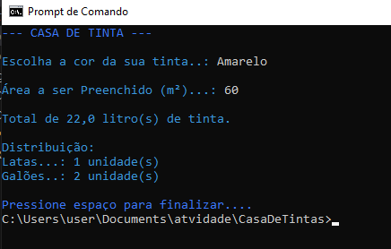

# CasaDeTintas

 Este programa é uma calculadora para auxiliar uma casa de tintas com as suas vendas. 
```
 Pedindo ao cliente:
 - A cor da tinta solicitada;
 - A área da parede a ser pintada (em m²);
```

## Exemplo
```
--- CASA DE TINTA ---

Escolha a cor da sua tinta..: Amarelo 

Área a ser Preenchido (m²)...: 60

Total de 22,0 litro(s) de tinta.   

Distribuição: 
Latas...: 1 unidade(s)
Galões..: 2 unidade(s)

Pressione espaço para finalizar.... 
```

## Screeshot



## Download

Baixe o arquivo abaixo. Descompacte na pasta desejada.

[🔗 Download do arquivo .zip](dist/CasaDeTintas.zip)

Execute utilizando o comando:

```
dotnet CasaDeTintas.dll
```

## Agradecimentos

- [Etec Adolpho Berezin](https://etecab.cps.sp.gov.br/)
- [Amanda Guimarães Dias](https://github.com/mandinha003)
- [Emily Francine Gomes](https://github.com/emilyfrancine2908)